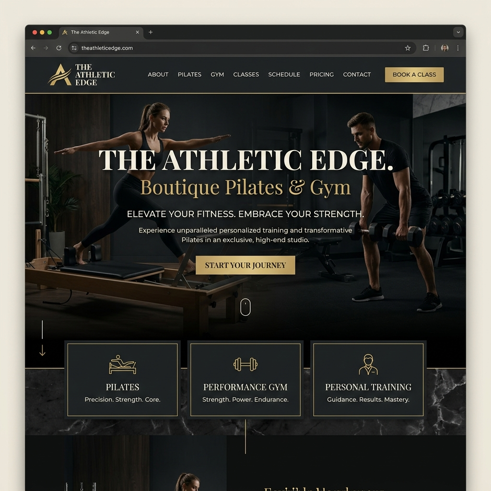

<div align="center">
  
  <h1>🏋️ The Athletic Edge</h1>
  <p><strong>Premium Boutique Fitness Studio & Pilates Sanctuary</strong></p>

  <p>
    <a href="https://opensource.org/licenses/MIT"></a>
    <a href="https://github.com/jaygupta-exe/athleticedge/issues"></a>
    <a href="https://github.com/jaygupta-exe/athleticedge/stargazers"></a>
    <a href="https://wa.me/919915677110"></a>
  </p>

  <h4>
    <a href="#-overview">Overview</a> •
    <a href="#-key-features">Features</a> •
    <a href="#-tech-stack">Tech Stack</a> •
    <a href="#-getting-started">Getting Started</a> •
    <a href="#-technical-showcase">Technical Showcase</a> •
    <a href="#-contact">Contact</a>
  </h4>
</div>

---

## 📖 Overview

**The Athletic Edge** is a high-end digital presence for a boutique fitness studio located in Ludhiana. Unlike generic gym websites, this project focuses on **luxury branding**, **precision movement (Pilates)**, and a **client-first digital experience**.

### Why this project?
This repository serves as a professional showcase of modern front-end capabilities:
- **Branding**: Translating a physical luxury space into a digital environment.
- **UX/UI**: Prioritizing high-conversion elements like "Book Demo" and WhatsApp integration.
- **Performance**: achieving a premium feel without heavy frameworks, using optimized vanilla technologies.

---

## 📸 Visual Preview



---

## ✨ Key Features

- 💎 **Premium Dark Aesthetic**: A curated color palette (Cream, Brown, Gold) designed to evoke luxury and focus.
- 🚀 **Advanced Animations**:
  - Custom **Preloader** for a smooth entry.
  - **Scroll-triggered reveals** using Intersection Observer API.
  - **Parallax Hero** section for depth.
  - **Custom Mouse Cursor** with smooth lerp (linear interpolation) following.
- 📱 **Adaptive Responsiveness**: 100% fluid layout optimized for everything from 4K monitors to the latest mobile devices.
- 📅 **Dynamic Membership Toggling**: A sleek, tabbed pricing system that allows clients to compare Pilates, Gym, and Combo plans instantly.
- 🎥 **Media Integration**: Optimized video backgrounds and a dynamic social media grid.
- ⚡ **SEO Engine**: Fully optimized with semantic HTML5, meta tags, `robots.txt`, and `sitemap.xml`.

---

## 🛠️ Tech Stack

### Frontend Core
-  **HTML5**: Semantic structure and ARIA compliance.
-  **CSS3**: Advanced Grid/Flexbox, Custom Variables, and Keyframe Animations.
-  **Vanilla JS**: Lightweight logic, DOM manipulation, and smooth scroll handling.

### Tools & Deployment
-  **Browsersync**: Hot-reloading development environment.
-  **Git**: Version control with professional commit standards.
-  **Prettier**: Automated code formatting.

---

## 🚀 Getting Started

Follow these steps to set up the project locally:

### Prerequisites
- Node.js installed on your machine.

### Installation
1. **Clone the repo**
   ```bash
   git clone https://github.com/jaygupta-exe/athleticedge.git
   ```
2. **Install dependencies**
   ```bash
   npm install
   ```
3. **Launch Dev Server**
   ```bash
   npm run dev
   ```
   *The site will open at `http://localhost:3000`*

---

## 🧠 Technical Showcase

### 1. Custom Cursor Engine
The project implements a high-performance custom cursor using `requestAnimationFrame` and `lerp` for smooth motion.
```javascript
function lerp(start, end, factor) {
    return start + (end - start) * factor;
}
// Smoothly updates ring position to follow the dot
ringX = lerp(ringX, mouseX, 0.15);
ringY = lerp(ringY, mouseY, 0.15);
```

### 2. Performance-First Asset Loading
- **Lazy Loading**: Images and videos use `loading="lazy"` to prioritize critical above-the-fold content.
- **WebP Support**: Assets are optimized for modern browser formats.
- **Modular CSS/JS**: Separated concerns for better caching and maintainability.

### 3. Professional Project Structure
```text
├── assets/             # Optimized media assets
├── css/                # Global styles and design system
├── js/                 # Main logic and animation engines
├── index.html          # Clean, semantic entry point
├── robots.txt          # SEO crawler instructions
└── sitemap.xml         # Search engine index map
```

---

## 🗺️ Roadmap

- [ ] **Booking Integration**: Direct integration with a booking system (e.g., Mindbody).
- [ ] **Client Portal**: Secure login for members to track their progress.
- [ ] **E-commerce**: Store for premium supplements and gym wear.
- [ ] **Blog Section**: Fitness and nutrition tips by experts.

---

## 🤝 Contact

**Jay Gupta** - Full Stack Developer
- **GitHub**: [@jaygupta-exe](https://github.com/jaygupta-exe)
- **Email**: [theathleticedge9@gmail.com](mailto:theathleticedge9@gmail.com)
- **Project Link**: [https://github.com/jaygupta-exe/athleticedge](https://github.com/jaygupta-exe/athleticedge)

---

<div align="center">
  <p>Designed with ❤️ in Ludhiana</p>
  <p>Copyright © 2025 The Athletic Edge. All rights reserved.</p>
</div>
